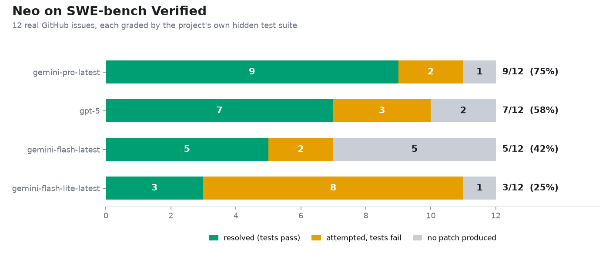

# Neo

[English](README.md) | **Français**

**Un harnais d'agents qui rend les petits modèles bon marché fiables sur de vraies tâches logicielles.**


Le principe de Neo : la fiabilité vient du harnais, pas du modèle. La plupart des échecs d'agent ne sont pas du mauvais code ; ils sont opérationnels : démarrer un serveur sur un port occupé, annoncer « c'est fait » sans vérifier, répéter une commande échouée au lieu d'en lire l'erreur. Neo place cette discipline dans du code déterministe, pour que des modèles rapides et bon marché (Gemini Flash, modèles locaux via Ollama) accomplissent des tâches qui exigent d'ordinaire un modèle frontière : créer et lancer des applications web, réparer celles qui sont cassées, piloter le bureau, lire des documents, et prouver chaque résultat avant d'annoncer un succès.

## L'idée centrale

```
 requête utilisateur (n'importe quelle langue)
        |
        v
 1. COMPRENDRE   un petit appel modèle classe l'intention dans un schéma strict
        |        {kind, wants_changes, needs_running_app}
        v
 2. EXECUTER     des pipelines déterministes pilotent le travail
        |        sonder -> installer -> port -> démarrer -> vérifier -> ouvrir
        v
 3. PROUVER      des contrôles de résultat décident du succès, jamais la parole du modèle
                 statuts HTTP, types MIME, dépendances manquantes, critères d'acceptation
```

Le modèle remplit les trous de contenu (écrire ce fichier, choisir cette coordonnée) ; l'ordre des opérations, la vérification et la récupération sont du code déterministe. Une exécution ne peut pas s'annoncer réussie sans preuve : un processus qui écoute réellement, un contrôle HTTP qui passe, un bilan de santé couvrant la fonctionnalité demandée. Une exécution qui ne change rien mais prétend avoir terminé est bloquée et renvoyée.

## Pourquoi ça marche avec des modèles plus faibles

Les petits modèles échouent sur le travail d'agent de façons prévisibles, hors du code. Neo traite chacune dans le harnais :

- **Séquençage manqué.** Ils tapent avant de placer le focus, démarrent un serveur avant d'installer, annoncent la fin avant de vérifier. Des outils composites réunissent cliquer-puis-taper en une action, et le runtime impose sonder -> installer -> port -> démarrer -> vérifier -> ouvrir, quel que soit l'ordre demandé.
- **Affirmations non vérifiées.** « L'application tourne » n'est pas une preuve. Neo n'accepte qu'un port qui écoute, une réponse 200 ou un bilan de santé qui passe ; une affirmation non étayée revient avec les preuves attachées.
- **Boucles d'échec.** En cas d'erreur, les petits modèles répètent la commande ou s'excusent. Neo réinjecte la sortie d'erreur dans le prompt, corrige les échecs déterministes dans l'outil même (un lockfile périmé bascule sur `npm install`), et relance les exécutions bloquées sous un plafond d'essais.
- **Ancrage visuel faible.** Le clic au pixel près est un talent de modèle frontière. Neo superpose une grille de coordonnées étiquetée pour que le modèle lise une position au lieu de l'estimer, et lance les applications de bureau directement.
- **Dérive de tâche.** Les longues tâches éparpillent les petits modèles sur des projets sans rapport. La classification d'intention fixe ce qu'est la requête, le ciblage de projet fixe ce qu'elle concerne, et le verdict refuse de clore tant que cette cible précise ne fonctionne pas.

Neo ne rend pas le modèle plus intelligent. Il réduit le rôle du modèle au remplissage de contenu et rend déterministe tout ce qui demande de la discipline. C'est pourquoi un modèle coûtant une fraction d'un modèle frontière accomplit ici les mêmes tâches.

## Ce qu'il y a dedans

- **Terminaux multi-agents** : plusieurs agents côte à côte avec un contexte partagé, chacun sur son fournisseur/modèle. Backend Flask, frontend React.
- **Fournisseurs** : Gemini, OpenAI, Anthropic, ou n'importe quel endpoint local compatible OpenAI (Ollama, LM Studio). Changement par agent depuis l'interface.
- **Plus de 60 outils sandboxés** pour les fichiers, le shell (PowerShell/WSL), Python, git, HTTP, la recherche et le scraping web, SQL, l'extraction de documents (PDF/Word/Excel), les audits de sécurité, la gestion de processus.
- **Vérification réelle** : `app_healthcheck` teste une application servie comme le ferait un utilisateur : page racine, chaque css/js référencé avec le bon type MIME, dépendances Node manquantes détectées avant le démarrage, plus des critères d'acceptation déclarés (POST /login avec admin/admin, attend "welcome") que le harnais exécute lui-même.
- **Classification d'intention** par un modèle, pas par des regex : le français, l'arabe, les fautes de frappe et les journaux d'erreur collés routent tous correctement. Les règles par mots-clés ne restent qu'en solution de repli.
- **Contrôle de l'ordinateur pensé pour les modèles faibles** : les captures d'écran reviennent avec une grille de coordonnées étiquetée, le modèle lit de vraies positions au lieu de les deviner. Les actions composites (`computer_type_at` = cliquer, attendre le focus, taper) suppriment le séquençage moteur que les petits modèles ratent. `open_app` lance les applications de bureau directement.
- **Gestionnaire de processus** qui distingue « démarré » de « en service » : un processus ne compte comme lancé que si son port écoute ou s'il survit à la fenêtre de démarrage ; les crashs remontent la sortie d'erreur au modèle. Le registre persiste sur disque, donc les serveurs orphelins d'une session précédente peuvent être récupérés.
- **Auto-récupération** : les exécutions bloquées sont relancées avec les preuves de l'échec injectées, bornées par un plafond d'essais et un garde-fou anti-stagnation.
- **Outils auto-réparants** : les outils corrigent eux-mêmes les échecs déterministes. `npm ci` avec un lockfile périmé bascule sur `npm install`, les shims `.cmd` de npm sous Windows se résolvent correctement, les ports occupés sont récupérés quand Neo possède le processus qui écoute.
- **Modes de permission** : le contrôle de l'ordinateur est verrouillé, via un mode « demander » avec autorisations temporaires ou un contrôle total.
- **Commandes slash** : `/ls`, `/tree`, `/grep`, `/model`, `/status` et d'autres s'exécutent directement côté backend, sans appel au modèle.
- **Un benchmark impossible à tromper.** Des scénarios déterministes traversent le vrai runner, les vrais outils et les vrais processus, notés sur les preuves en base et l'état du système de fichiers, jamais sur le texte du modèle. Parmi eux : un modèle qui ment (doit finir bloqué), une exécution qui prétend des changements non faits, et un critère d'acceptation en échec qu'aucune prose ne peut contourner. Le taux de faux succès est la métrique principale, et il reste à zéro.

## Démarrage rapide

Prérequis : Python 3.11+, Node 18+, et au moins une clé d'API de modèle (ou un serveur local compatible OpenAI).

```bash
git clone https://github.com/AramDevops/neo.git
cd neo

# backend
python -m venv venv
venv/Scripts/pip install -r requirements.txt        # Windows
# venv/bin/pip install -r requirements.txt          # Linux/macOS

# frontend
cd frontend
npm install
npm run build
cd ..

# configuration
cp .env.example .env      # puis mettez vos clés d'API dans .env

# lancement
venv/Scripts/python app.py
```

Ouvrez `http://127.0.0.1:8791`, créez un terminal, choisissez un fournisseur et entrez une tâche telle que : *« crée une application d'éditeur markdown et lance-la »*.

Pour le développement frontend, lancez `npm run dev` dans `frontend/` (port 8792, proxy `/api` vers le backend).

### Configuration

Tout se règle dans `.env` (voir `.env.example` pour la liste complète) :

| Variable | Rôle |
|---|---|
| `GEMINI_API_KEY` / `OPENAI_API_KEY` / `ANTHROPIC_API_KEY` | clés des fournisseurs ; au moins une |
| `NEO_PROVIDER`, `NEO_MODEL` | fournisseur et modèle par défaut des nouveaux agents |
| `NEO_LOCAL_BASE_URL`, `NEO_LOCAL_MODELS` | endpoint local compatible OpenAI (Ollama, etc.) |
| `NEO_DB_DRIVER` | `sqlite` (défaut, zéro configuration) ou `mysql` |
| `NEO_MAX_AGENT_LOOPS` | boucles d'appels d'outils par exécution (défaut 12) |
| `NEO_AUTO_RECOVERY_MAX` | relances automatiques bornées des exécutions bloquées (défaut 2) |

Extras optionnels pour le contrôle du bureau et les documents : `pyautogui`, `mss`, `Pillow`, `pypdf`, `python-docx`, `openpyxl` (tous dans `requirements.txt`).

## Performances

Un harnais ne vaut que le vrai travail qu'il livre. Neo est donc mesuré sur [SWE-bench Verified](https://www.swebench.com/), le benchmark de référence pour les agents de code : de vrais tickets GitHub de vrais projets, où un correctif ne compte que si la suite de tests cachée du projet passe. Pas de correspondance de chaînes, pas de modèle qui se note lui-même.



Sur 12 vrais tickets, **`gemini-pro-latest` résout 9 (75%)** avec la boucle de retour de tests de Neo - il applique un correctif, voit quels vrais tests du projet échouent encore, et itère jusqu'à ce qu'ils passent. `gpt-5` en résout 7, et les niveaux `gemini-flash` efficaces en font 5 et 3. Chaque correctif est vérifié par les propres tests du projet ; quand Neo ne peut pas résoudre un ticket, il ne livre aucun patch, jamais un faux plausible.

**Et le harnais s'affûte lui-même.** Faire tourner plusieurs modèles révèle où *Neo* est le goulot d'étranglement, pas le modèle. Ce travail a mis au jour deux vrais bugs du harnais - une vérification navigateur déclenchée à tort sur de purs correctifs de code, et le patch en un coup sans moyen de se rattraper après un test échoué. Les corriger (la boucle de retour de tests) a fait passer `gemini-pro` de 6/12 à 9/12 et `gpt-5` de 3 à 7. Un benchmark qui améliore l'outil qu'il mesure.

Neo édite une copie du dépôt sur l'hôte, produit un diff git, et le diff est noté dans un conteneur Docker scellé par les vrais tests du dépôt.

Pour un test rapide de modèle, Neo fournit aussi une éval interne :

```bash
pip install matplotlib   # une fois, pour les graphiques
python -m neo.services.model_compare --models gemini-flash-lite-latest,gemini-flash-latest,gemini-pro-latest
```

Ajoutez `--demo` pour prévisualiser le format sans aucun appel d'API.

## État et feuille de route

Neo est jeune et avance vite. Windows est la cible principale aujourd'hui (les outils shell et de contrôle du bureau s'appuient sur PowerShell et le bureau Win32) ; le cœur du harnais, les outils et la vérification tournent partout où Python tourne. Au programme :

- des critères d'acceptation plus riches (assertions DOM, comparaison de captures)
- une machine à états en graphe de tâches pour les longues constructions multi-étapes
- plus de scénarios de benchmark et de langages
- un contrôle du bureau Linux/macOS de premier ordre

Les contributions sont bienvenues. Ouvrez une issue pour tout ce qui surprend, ou une PR si vous avez déjà corrigé. Lancez le benchmark avant et après votre changement.

## Licence

MIT, voir [LICENSE](LICENSE).

Créé par [Akram Nasr](https://github.com/AramDevops).
